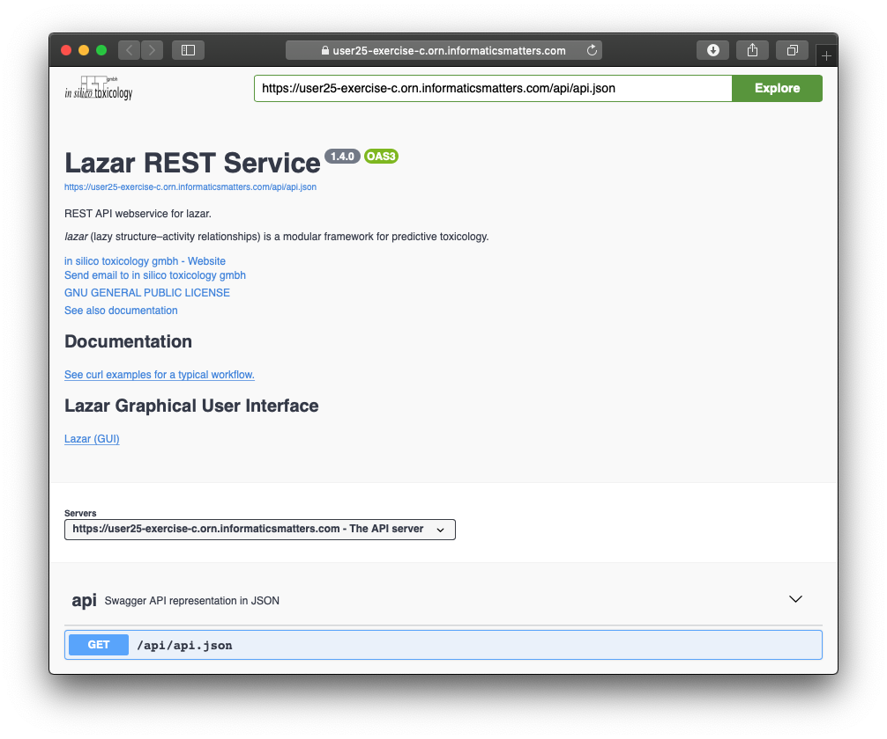

# Development Workshop - Exercise C

[toc](../README.md) | [prev](../exercise-b/README.md) | [next](../tutorial-3/README.md)

In  this exercise we deploy a real-world OpenRiskNet application (**Lazar**)
from the OpenShift Command-Line.

---

>   The OpenRiskNet **Lazar** predictive toxicology service application is
    briefly described on the OpenRiskNet [deployments page]. Here we'll
    concentrate on the deployment of the application.

## Move to correct location in the repo

Change directory to where the files for the exercise are located:

    cd ~/workshop/wp2-deployment-workshop-2019/exercise-c

## Login
If you need to, login to the server. If you're already logged in you won't
need to provide your password: -

    oc login -u ${WORKSHOP_USER} https://orn-master.informaticsmatters.com
    ...

## Creating a namespace (project)
Use the command-line to create a project: -

    oc new-project ${WORKSHOP_USER}-exercise-c

## Deploying the application image
The OpenShift deployment of **Lazar** is defined in a single YAML file,
replicated in this exercise directory. It consists of the following objects: -

-   An **ImageStream**
-   A **DeploymentConfig**
-   A **Service**
-   A **Route**

In its simplest form an **ImageStream** is a Docker image identified by a
tag (it's actually much more than that but we don't have time to go into the
detail of each object). Lazar uses it as a 'trigger' for the container image
so the **Pod** automatically re-deploys when the image changes.

>   You can read more about ImageStreams in the [image streams section] of
    the OpenShift documentation.

Incidentally, it's often more flexible to restrict OpenShift templates to a
*one-file-one-object* scheme. This is not always possible, especially
where parameters need to be shared between closely related objects.
But it is a reason to consider the use of playbooks or roles that employ
the Ansible **k8s** module.

>   The template we're using has been adjusted for the workshop.
    The latest production template and documentation can be found on the
    OpenRiskNet site's [deployments page].

**Lazar** is controlled through the use of a number of **Parameters**,
defined in its OpenShift template so we need to understand how we can *override*
template parameters from the command-line before we can install it as its
default parameter values may not be appropriate for our use.
If you inspect the `lazar.yaml` template you'll see default values for
parameters like the `IMAGE_NAME` and `ROUTE_NAME`.

You can change parameter values on the command-line via the `process` command's
`-p` option.

Because several users may be running this Exercise at the same time
we *must* change one parameter, the `ROUTE_NAME`. We can't all deploy **Lazar**
and use the same **Route** name. We can do this simply by using our username.

    oc process -f lazar.yaml -p ROUTE_NAME=${WORKSHOP_USER}-exercise-c | oc create -f -

Lazar is a large (1.6Gi) and complex application that may take a minute or two
to become 'ready'. The time will depend on whether whether Lazar is known to
OpenShift and whether it first needs to be downloaded from the external Docker
registry where it is hosted.

You can visit your project's **Overview** page to see the
state of the deployment where, at some point, you will
see the **Pod** and its familiar blue outline along with a **Service**
and **Route**: -

When 'ready' you should be able to navigate to the application's landing page
using the **Route** link: -

>   The Lazar **Route** expects secure traffic via the HTTPS protocol.
    Insecure traffic is redirected. Consequently you may be warned about this
    by your browser. For now you should acknowledge the security warning and
    then proceed to the application website regardless. Feel free to inspect
    the template to see these object properties.

### A note about Lazar's container privileges

We haven't mentioned container security and privileges up to this point
but they're worth mentioning here, in the **Lazar** project.

By default, all containers that are launched within OpenShift,
are blocked from the ability to **“RunAsAny”** user, which basically means
that they are not allowed to use a root or a specific user ID within the
container.

This prevents root actions such as `chown` or `chmod` from being run and is a
sensible security precaution as, should a user be able to perform a local
exploit to break out of the container, then they would not be running as root
on the underlying container host.

>   You can read more about this aspect of OpenShift in the
    [Getting any Image running] RedHat blog post.

The current implementation of **Lazar** does depend on the ability
of its container to execute root operations.

But your deployment worked regardless. Why?

That's because your project has been pre-configured ('behind the scenes')
to allow **privileged** ("RunAsAny") containers. Without this pre-configuration
the **Lazar** container would be prevented from executing by OpenShift.

If you want to see what happens to the **Lazar** container with default
privileges repeat this exercise using a different project
name, say `${WORKSHOP_USER}-exercise-c-2`.

## Delete the project
Clean up by deleting the project.

    oc delete project/${WORKSHOP_USER}-exercise-c
    
---

[toc](../README.md) | [prev](../exercise-b/README.md) | [next](../tutorial-3/README.md)

[deployments page]: https://github.com/OpenRiskNet/home/tree/master/openshift/deployments/lazar
[getting any image running]: https://blog.openshift.com/getting-any-docker-image-running-in-your-own-openshift-cluster/
[image streams section]: https://docs.openshift.com/enterprise/3.0/architecture/core_concepts/builds_and_image_streams.html#image-streams
