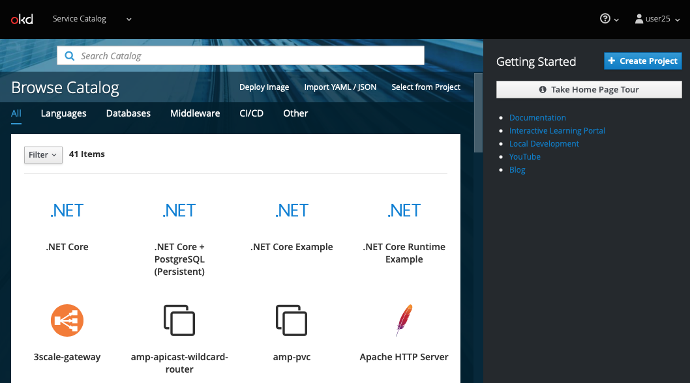

# Workshop setup

[toc](../README.md) | [next](../tutorial-1/README.md)

Here we describe getting setup for the workshop.

---

## What you'll need

1. A login for the workshop's OpenShift environment
1. A modern web browser (ideally Google Chrome)

If you're not using the workshop-provided VM: -

1. The `oc` command line tool
1. Access to a clone of the GitHub repository

## Operating environment

You can perform the exercises in two ways:

**Option 1**: login to a VM that we provide that provides all the pre-requisites

>   This is the preferred approach. You need to grab yourself a username and then
    `ssh` to the server as described below.

**Option 2**: use your own laptop/server

>   Choose this option if you prefer, but our ability to assist if things go wrong
    may be limited. As well as grabbing yourself a username you will need to
    install the `oc` client and clone the GitHub repository as 
    described below.

## User account

Each attendee will have their own user account for performing the exercises.
A number of users  (user1, user2, ...) have been setup with passwords. Open 
[this Google sheet](https://docs.google.com/spreadsheets/d/1HUgsfSz3dyRDPXQq55t_bGhoDw9CS7U6d1oHadJg94s)
to see these users and write your name in the `owner` column to claim that username.
Once you have entered  your name reload the page in your browser to ensure that
you have successfully claimed that username.

That username and password will be used for your login to OpenShift
and your login to the shared server.

## Project naming etiquette

When it comes to creating OpenShift projects please conform to a convention
that allows everyone to identify your project. The convention is that the
project should be named `<username>-<exercise>`. For instance if you are `user7`
and  are working on `exercise C` then name your project `user7-exercisec`.

This avoids name clashes and makes it easier for the workshop organisers to
step in and assist. 

## The oc command line tool

`oc` is a program that lets you execute commands against the OpenShift API.
If you are familiar with Kubernetes then `oc` is an extension of the `kubectl`
program, adding some OpenShift specific commands.

### Option 1: Using a login on the workshop VM

To avoid the need to install `oc` on your computer we have set up a simple
Linux virtual machine that has `oc` already installed. Each user in the Google
sheet mentioned above has a login with the corresponding password.

To login you will need a `ssh` client on your computer. Linux, Mac and recent
Windows 10 machines will have that pre-installed. For older Windows machines
you might want to download and install 
[Putty](https://www.chiark.greenend.org.uk/~sgtatham/putty/latest.html).

To login with your selected user use `ssh`: -

    ssh <user>@cloudv197.zdv.uni-mainz.de
    password: ********

You'll be in the user's home directory (i.e. `/home/<user>`) where you'll
find the workshop material, where you'll find the exercises and tutorials: -

    cd ~/workshop/wp2-deployment-workshop-2019
    
### Option 2: Installing oc on your computer

Alternatively you can download and install `oc` on your laptop.
Download the appropriate version. See the `Download oc Client Tools` section
[here](https://www.okd.io/download.html).

You should just need to download the file, unzip it and make sure
that the `oc` binary is on your PATH.

>   The OpenShift console provides a link to the command-line tools.
    From the console login page select the **Command Line Tools** option
    from the **Help** dialogue (the **?** in a circle icon). You will have a
    link to the **Latest Release** for OpenShift 3.11 where you can download
    and unpack a suitable package for your OS (linux, Mac, Windows).

## Logging in to Openshift

### Using a web browser

Go to [the console] and enter the username and password your claimed earlier.
Once logged in you will see a page like this:

### Using the oc CLI
The Exercises provide command-line examples that, to simplify their execution,
rely in the existence of the `WORKSHOP_USER` environment variable. If you've
logged into the workshop VM this will have been set for you automatically.

>   If you are not using the workshop VM you will need to set the environment
    variable in your shell so you can cut-and-paste from the examples
    with your chosen username, i.e. `export WORKSHOP_USER=user1`

The `oc` command is used to execute all of the OpenShift commands we'll be using.
But first, you need to use `oc` to connect to the workshop server: -

    oc login -u ${WORKSHOP_USER} https://orn-master.informaticsmatters.com

You can always run `oc` to get some basic help: -
    
    oc
    ...

And any other commands that are available: -

    oc project
    ...
    oc whoami
    ...

## After the workshop: Minishift

In the workshop you will be using a test OpenShift environment running externally.
This environment will not be available after the workshop. If you wish to
continue with these exercises after the workshop then you might want to
consider running `Minishift` which is a *mini* OpenShift environment that can be
run on your laptop. Once started Minishift provides a fully functional local
OpenShift environment that can be used for development.

See [these instructions](https://docs.okd.io/latest/minishift/getting-started/installing.html)
for installing and running Minishift.

## Workshop GitHub repo

The workshop exercises use files from the GitHub repo that contains
this workshop material. You need to have a clone of the repo to get access
to the files.

**If using the provided VM (Option 1)**

The cloned repo is already present in VM and in your home directory
at `~/workshop`.

**If using your own laptop/server (Option 2)**

First install the Git version control software on your computer if not already
present. See [here](https://git-scm.com/downloads) for a version for your
computer.

Now clone the repo:

    git clone https://github.com/OpenRiskNet/workshop.git
    
Alternatively you can download a zip file of the repo from 
[here](https://github.com/OpenRiskNet/workshop/archive/master.zip).
Once downloaded unzip the contents to somewhere on your computer. 

**Repository layout**

Whichever mechanism you use to access the GitHub repo you need to start from
the `wp2-deployment-workshop-2019` directory in the repo: -

    cd [...]/workshop/wp2-deployment-workshop-2019

...where you will find directories for each of the exercises and the tutorials.

---

[toc](../README.md) | [next](../tutorial-1/README.md)

[the console]: https://orn-master.informaticsmatters.com
