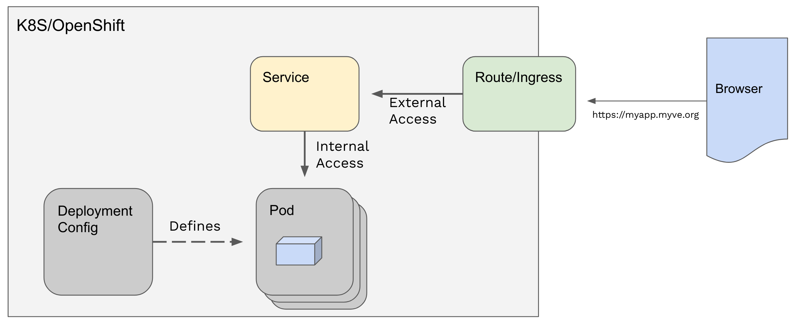

# Description of key Kubernetes objects

[toc](../README.md) | [prev](../exercise-a/README.md) | [next](../exercise-b/README.md)

Here we describe some of the key OpenShift objects and explain what happened in the last exercise. 

---

In the last exercise we just told OpenShift the name of a container image to use and then a lot of magic happened.
We'll now explain some of this magic.

In Kubernetes containers run as **pods**. A **pod** is a wrapper for one or more containers and the Kubernetes controllers
interact with **pods** which themselves control the containers running in them. In many cases a **pod** runs a single 
container and that **pod** can be thought of as the running container.

We can start and stop pods using the API, but we don't usually do that. Instead we create a **deployment config** (or a Deployment)
that describes the deployment of a pod. The **deployment config** acts as a manager for the pod ensuring it is behaving as required.
For instance, if the pod crashes the **deployment config** will restart it. If you tell the **deployment config** that you want
3 replicas of your pod then OpenShift will try to ensure that there are 3 running. If you created a 'bare' pod then none of this 
would happen - if the pod crashed it stay crashed until you noticed and manually re-created it.

We just introduced the concept of scaling an app through having multiple replicas. Maybe your pod is providing an API that other pods 
want to use, and usage meant that one pod could not handle all of your requests. Or maybe you wanted some resiliance so that if a pod 
crashed there was another identical one running that could still handle the requests whilst the crashed pod was being replaced. 
But how would that another application know where the pods were? This changes over time as your pod was scaled up or down or
as OpenShift reloacted to the pod to a different server. To address thiss you don't access pods directly, you do this through a 
**service** which acts as a load balancer for the pods, and keeps track of where the pods are. That way you just access the service
which has a location that doesn't change and the service redirects your request to one of the pods it is serving.

When we created the **PySimple** app through the web console in [Exercise A](../exercise-a/README.md) what happened is that OpenShift
created a **deployment config** for the PySimple pod, set the number of replicas to 1 (as well as a number of other default parameters)
and created a **service** for that pod.

You'll reacall that in Exercise a we also manually created a **route** for the **service**. A **route** directs traffic from outside the 
OpenShift cluster to the service. The service allows traffic from **within** the cluster to arrive at the pod, but for traffic from
**outside** the cluster you need a **route** that acts as a proxy for the service. When you created the PySimple app OpenShift doesn't
know whether you want to route traffic from outside, and assumes you don't. Hence why you need to manually add the route yourself.

The diagram above shows the relationship of the **pod**, the **deployment config**, the **service** and the **route**.

Next we will look at how to deploy PySimple using the CLI rather than the web console.

---
[toc](../README.md) | [prev](../exercise-a/README.md) | [next](../exercise-b/README.md)

